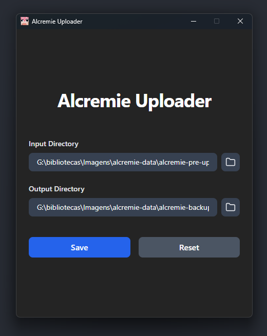

# Alcremie Uploader Desktop APP




<br />

## About

This desktop application is built using Electron, React, and TypeScript. It is designed to streamline the process of uploading images to the Alcremie image platform. The app runs in the system tray, allowing users to easily upload images by validating specified folders and automatically sending the files to Alcremie when triggered. It provides a simple and efficient way to manage and upload images.

## Requirements

- node js

## Run Locally

Clone the project

```bash
  git clone https://github.com/SidneyRoberto9/alcremie-uploader
```

Go to the project directory

```bash
  cd alcremie-uploader
```

Install dependencies

```bash
  npm install
```

For build use

```bash
  npm run dist:win #for Windows
  npm run dist:linux #for Linux
  npm run dist:mac #for Mac
```

And files to install or execute

```bash
  cd dist
```
